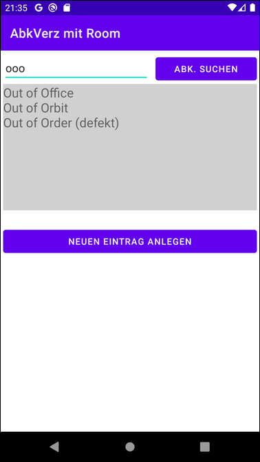
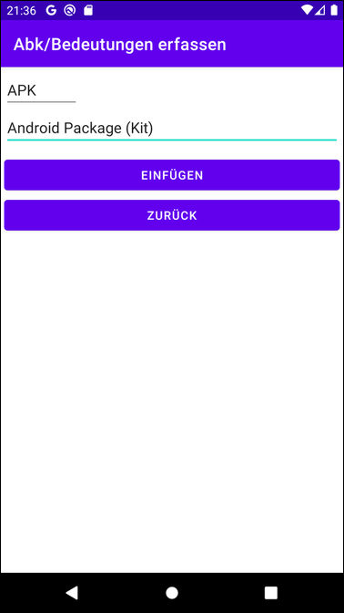

# Android-App "AbkVerz mit Room" #

 

Simple Android app that demonstrates persistency with 
[Room](https://developer.android.com/training/data-storage/room/) (Android's ORM). 
The app can store one or more meanings for an abbrevation, i.e. it demonstrated how to maintain 
one-to-many relationships in Android. 
There is another variant of this app which uses SQLite directly (i.e. without Room), see
[here](https://github.com/MDecker-MobileComputing/Android_AbkVerz).

 

----

## Screenshots ##

 

  

 

----

## License ##

 

See the [LICENSE file](LICENSE.md) for license rights and limitations (BSD 3-Clause License).

 